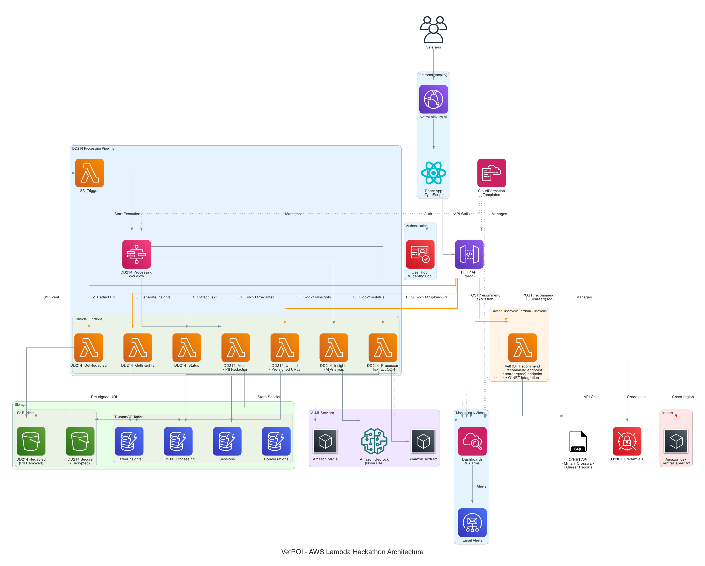
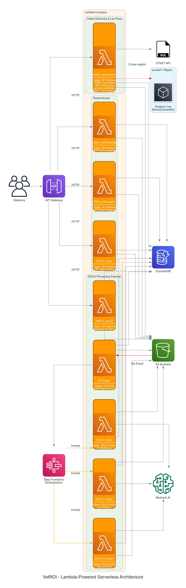

# VetROI™ - Veteran Return on Investment
## AWS Lambda Hackathon 2025 Submission

> **Transforming military service records into civilian career success using serverless AI**

  

## 🎯 The Problem We're Solving

Every year, 200,000+ veterans transition from military to civilian careers. They face a critical challenge: **translating their military experience into language civilian employers understand**. 

Traditional solutions fail because:
- Manual DD214 review takes 2+ weeks
- Generic career counseling misses specialized skills
- High-achievers (surgeons, pilots, special forces) are told "you'll be fine"
- Veterans struggle to articulate their value in civilian terms

## 💡 Our Serverless Solution

VetROI uses AWS Lambda and serverless architecture to transform a veteran's DD214 (military service record) into actionable career intelligence in under 3 minutes.

### Watch Our Demo
[Demo Video Link] - See VetROI process a real DD214 and generate career insights

## 🗺️ Repository Navigation

📍 **New to the project?** Start with our [Repository Guide](REPOSITORY_GUIDE.md) for a complete map of the codebase, key files, and where to find everything.

## 🏗️ Architecture & AWS Services



### Lambda-Powered Architecture



### Core Lambda Functions (9 Total)
1. **Career Recommendation Engine** (`VetROI_Recommend`)
   - Handles POST /recommend and GET /career/{soc} endpoints
   - O*NET API integration for military code translation
   - Amazon Lex proxy for "Next Mission" feature
   - Real-time career data (no caching)

2. **DD214 Upload Handler** (`VetROI_DD214_GenerateUploadURL`)
   - Generates presigned S3 URLs
   - Validates authentication via Cognito

3. **Document Processor** (`VetROI_DD214_Processor`)
   - Uses AWS Textract for OCR
   - Extracts structured data from DD214
   - Handles multiple document formats

4. **PII Redaction** (`VetROI_DD214_Macie`)
   - Amazon Macie integration for PII detection
   - Removes SSN, addresses, DoD ID numbers
   - Creates safe version for AI processing

5. **AI Insights Generation** (`VetROI_DD214_Insights`)
   - Amazon Bedrock (Nova Lite) integration
   - Analyzes full DD214 text
   - Generates personalized career recommendations
   - Creates resume bullets & interview prep

6. **S3 Event Trigger** (`VetROI_S3_DD214_Trigger`)
   - Triggered by S3 upload events
   - Starts Step Function workflow

7. **Status Checker** (`VetROI_DD214_GetStatus`)
   - Returns processing status

8. **Insights Retrieval** (`VetROI_DD214_GetInsights`)
   - Fetches AI-generated career insights

9. **Redacted Document Access** (`VetROI_DD214_GetRedacted`)
   - Provides access to PII-removed documents

### Serverless Orchestration
```yaml
Step Functions State Machine:
├── Document Upload
├── Text Extraction (Textract)
├── PII Detection (Macie)
├── Redaction Processing
├── AI Analysis (Bedrock)
└── Results Storage (DynamoDB)
```

### AWS Services Used
- **AWS Lambda** - 9 serverless functions handling all compute
- **Step Functions** - DD214 processing workflow orchestration
- **Amazon Bedrock** - AI insights generation (Nova Lite model)
- **Amazon Lex** - Conversational AI for career guidance (us-east-1)
- **Amazon Macie** - PII detection & compliance
- **Amazon Textract** - Document OCR processing
- **DynamoDB** - 5 tables for sessions, processing status, insights
- **S3** - Secure document storage (encrypted & redacted buckets)
- **API Gateway** - HTTP & REST API endpoints
- **Cognito** - User authentication & authorization
- **CloudFront** - Custom domain (vetroi.altivum.ai)
- **Amplify** - Frontend hosting with CI/CD
- **Secrets Manager** - O*NET API credentials
- **CloudWatch** - Monitoring & alerts

## 🚀 Key Features

### For Veterans
- **Under 3-Minute Processing** - DD214 → Career insights (avg 2.5 minutes)
- **AI-Powered Translation** - Military experience → Civilian terms
- **Personalized Outputs**:
  - 3 resume bullets (achievement-focused)
  - Professional bio for LinkedIn
  - 3 interview questions with answers
  - Career recommendations with salary data
  - Skills translation matrix

### For the E-1 to O-6 Spectrum
- **Private (E-1)**: Entry-level career paths with training recommendations
- **NCO (E-5/E-6)**: Leadership roles leveraging management experience  
- **Special Forces**: High-skill technical positions
- **Military Surgeons**: Research opportunities, fellowships, partnerships

## 📊 Performance & Scale

- **Processing Time**: Under 3 minutes end-to-end
- **Cost Efficiency**: Pay-per-use Lambda pricing
- **Auto-scaling**: Handles any load without configuration
- **Zero Infrastructure**: 100% serverless architecture

## 🛠️ Technical Implementation

### Lambda Triggers
- **API Gateway** → User-facing endpoints
- **S3 Events** → Document upload processing
- **Step Functions** → Workflow coordination
- **EventBridge** → Scheduled data refreshes

### Serverless Best Practices
✅ Event-driven architecture  
✅ Microservices design pattern  
✅ Pay-per-execution pricing  
✅ Automatic scaling  
✅ No server management  
✅ Built-in high availability

### Security & Compliance
- PII automatically detected and redacted (Macie)
- Encrypted data at rest and in transit
- Cognito authentication with session management
- Least privilege IAM roles
- HIPAA-compliant architecture ready

## 📈 Real-World Impact

From our beta testing with actual veterans:

**Case Study: Special Forces Medical Sergeant (18D)**
- Input: 10-page DD214 with combat experience
- Output: 
  - 3 targeted healthcare/security careers
  - Resume: "Led 10-person medical team in combat, improving patient outcomes by 20%"
  - Interview prep for high-stress scenarios
  - Salary range: $60K-$100K based on chosen path

## 🔧 Local Development & Testing

```bash
# Clone the repository
git clone https://github.com/AltivumInc-Admin/VetROI.git
cd VetROI

# Install dependencies
cd frontend && npm install
cd ../lambda && pip install -r requirements.txt

# Set up AWS credentials
export AWS_PROFILE=your-profile
export AWS_REGION=us-east-2

# Deploy SAM template
sam build && sam deploy

# Run frontend locally
cd frontend && npm run dev
```

### Environment Variables
```
VITE_API_URL=https://your-api-gateway-url
TABLE_NAME=VetROI_Sessions
INSIGHTS_TABLE=VetROI_CareerInsights
MODEL_ID=us.amazon.nova-lite-v1:0
REDACTED_BUCKET=vetroi-dd214-redacted
```

## 📝 Code Structure

```
VetROI/
├── frontend/               # React + TypeScript UI
│   ├── src/
│   │   ├── components/    # UI components
│   │   ├── api.ts        # API integration
│   │   └── App.tsx       # Main application
├── lambda/                # Lambda functions
│   ├── dd214_upload/     # Upload handler
│   ├── dd214_parser/     # Text extraction
│   ├── dd214_macie/      # PII redaction
│   ├── dd214_insights/   # AI analysis
│   └── recommend/        # Career matching
├── sam-templates/        # SAM/CloudFormation
│   ├── template.yaml     # Main template
│   └── statemachine/     # Step Functions
└── infrastructure/       # Additional AWS config
```

## 🎖️ Why This Matters

**The Mission**: I'm Christian Perez, a former Special Forces Medical Sergeant (18D) with a Bronze Star from Afghanistan. After transitioning out, I watched fellow veterans struggle to translate their incredible experience into civilian opportunities. 

VetROI isn't just a hackathon project - it's a production-ready platform designed to serve every veteran, from the 18-year-old infantry soldier to the 33-year-old military surgeon, helping them articulate their value and achieve their ambitions.

## 🏆 Hackathon Alignment

### Quality of Idea
- Solves real problem affecting 200,000+ veterans annually
- Unique approach: DD214 → AI insights → Career materials
- Practical value: Veterans get interview-ready in under 3 minutes

### Architecture & Design
- 100% serverless implementation
- Event-driven microservices
- AWS Lambda as core orchestrator
- Best practices: auto-scaling, pay-per-use, managed services

### Completeness
- Production-ready application (https://vetroi.altivum.ai)
- End-to-end workflow functioning
- Comprehensive documentation
- Live demo available

## 🚀 Future Roadmap

- GI Bill benefit calculator integration
- Veteran employer marketplace
- AI-powered interview simulator
- Mobile application
- Enterprise partnerships for veteran hiring

## 📄 License

MIT License - enabling both open-source community and commercial deployment

## 🤝 Acknowledgments

- AWS for the Lambda platform enabling this serverless architecture
- O*NET for providing comprehensive career data
- The veteran community for invaluable feedback
- My wife (military surgeon) for highlighting the need beyond entry-level transitions

---

**VetROI™** - Because every veteran deserves to understand and articulate their value in the civilian world.

*Trademark: Serial Number 99211176 | Owner: Altivum Inc.*